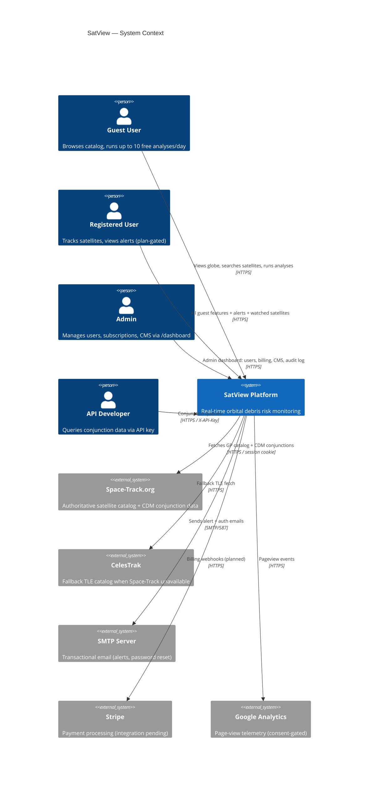
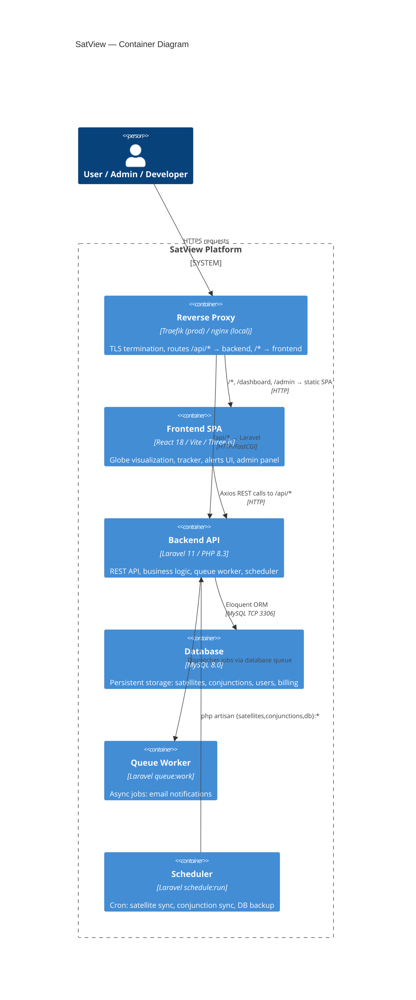
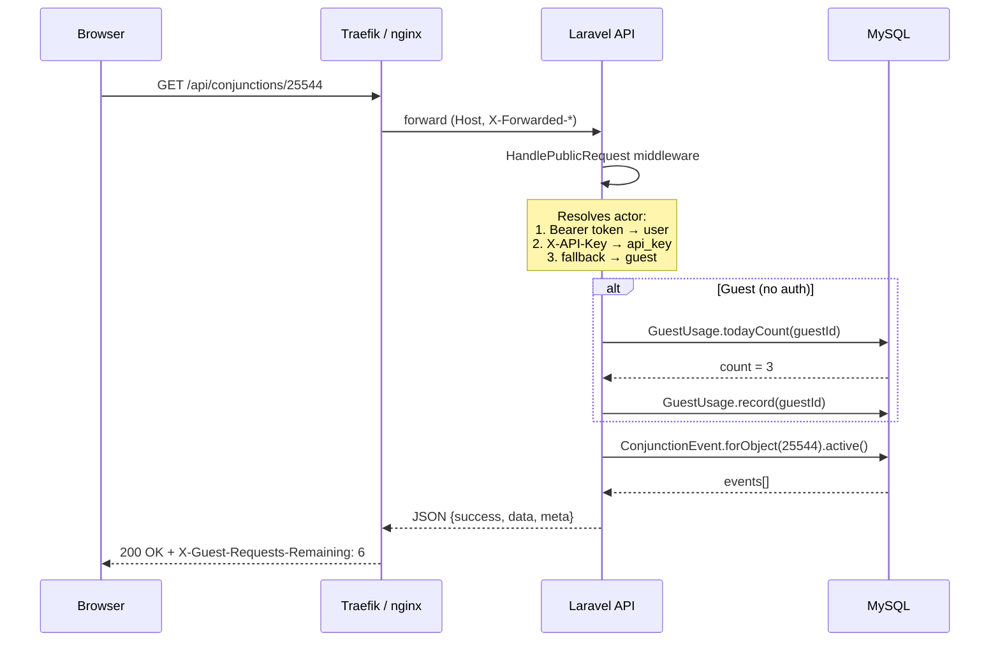

# 1. Architecture Overview

## 1.1 System Context (C4 Level 1)



---

## 1.2 Container Diagram (C4 Level 2)



---

## 1.3 Technology Stack

### Backend
| Layer | Technology | Notes |
|-------|-----------|-------|
| Framework | Laravel 11 | PHP 8.3, API-only (no Blade routes except welcome) |
| Auth | Laravel Sanctum | Two guards: `sanctum` (users), `admin` (AdminAccount) |
| ORM | Eloquent | Soft deletes on ApiKey; all others hard-delete |
| Queue | Laravel Database Queue | Jobs table; `queue:work` in worker container |
| Scheduler | Laravel Scheduler | `schedule:run` every 60 s in scheduler container |
| HTTP Client | Guzzle + Laravel Http | Guzzle for Space-Track (cookie jar); Http facade elsewhere |
| Testing | Pest + PHPUnit | 18 feature test files, SQLite in-memory |
| Code style | Laravel Pint | PSR-12 enforced |

### Frontend
| Layer | Technology | Notes |
|-------|-----------|-------|
| Framework | React 18 | Vite 6, JSX (no TypeScript) |
| 3D Globe | Three.js | InstancedMesh for 32 K+ objects; satellite.js for SGP4 propagation |
| Routing | React Router v6 | SPA with nested routes for admin |
| HTTP | Axios | Two clients: `client.js` (user API) and `adminClient.js` (admin API) |
| State | React useState / useRef / Context | No Redux; localStorage for persistence |
| Auth | AuthContext / AdminAuthContext | Sanctum token stored in localStorage |
| Testing | Vitest + React Testing Library | 5 frontend test files |

### Infrastructure
| Component | Technology |
|-----------|-----------|
| Containerization | Docker / Docker Compose |
| Production proxy | Traefik 3 (TLS via Let's Encrypt ACME) |
| Image registry | GitHub Container Registry (GHCR) |
| CI/CD | GitHub Actions (`ci.yml` + `cd.yml`) |
| DB backups | `deploy/backup-db.sh` → Cloudflare R2 via rclone |

---

## 1.4 Request Flow — Typical API Call



---

## 1.5 Monorepo Layout

```
debris-monitor/
├── backend/                    Laravel 11 application
│   ├── app/
│   │   ├── Console/Commands/   Artisan commands (sync, check, backup)
│   │   ├── Http/
│   │   │   ├── Controllers/    Public + Admin REST controllers
│   │   │   ├── Middleware/     HandlePublicRequest, SecurityHeaders, EnsureIsAdmin
│   │   │   └── Requests/       Form request validation
│   │   ├── Models/             Eloquent models (15 total)
│   │   ├── Notifications/      ConjunctionAlertNotification
│   │   └── Services/           SpaceTrackClient, EntitlementService, TlePropagator
│   ├── database/
│   │   ├── migrations/         22 migration files
│   │   └── seeders/            Admin, demo alerts, pages
│   └── routes/
│       ├── api.php             All REST routes
│       └── console.php         Cron schedule definitions
│
├── frontend/                   React 18 SPA
│   └── src/
│       ├── App.jsx             Root component, routing, view switcher
│       ├── DebrisMonitor.jsx   Catalog view (Three.js globe)
│       ├── satellite-tracker.jsx Tracker view (Three.js + satellite.js)
│       ├── ConjunctionAlerts.jsx Alerts view
│       ├── api/                Axios client instances
│       ├── components/         NavBar, ProtectedRoute, CookieBanner…
│       ├── contexts/           Auth, AdminAuth, Toast, CookieConsent
│       ├── layouts/            AdminLayout, AuthLayout
│       └── pages/              Login, Register, UserDashboard, all Admin pages
│
├── deploy/                     Server-side operational scripts
│   ├── backup-db.sh            Daily MySQL → R2 backup
│   └── restore-db.sh           Restore from local or R2
│
├── docker/                     Shared nginx configs
├── docs/                       deployment.md
├── documentation/              This documentation suite
└── .github/workflows/          ci.yml, cd.yml
```
