# 2. Database Schema

## 2.1 Entity-Relationship Diagram

```mermaid
erDiagram

    users {
        bigint id PK
        string name
        string email UK
        string password
        timestamp email_verified_at
        string status "active | suspended"
        timestamp suspended_at
        json addons "capability overrides"
        string remember_token
        timestamps created_at
    }

    subscriptions {
        bigint id PK
        bigint user_id FK
        string name
        string stripe_id
        string stripe_price
        string plan "free | starter | pro | enterprise"
        string status "active | canceled | past_due"
        timestamp current_period_start
        timestamp current_period_end
        timestamp canceled_at
        timestamps created_at
    }

    payments {
        bigint id PK
        bigint user_id FK
        string stripe_payment_intent_id UK
        string plan
        int amount_cents
        string currency
        string status
        json metadata
        timestamps created_at
    }

    api_keys {
        bigint id PK
        bigint user_id FK
        string name
        string key UK "dm_live_*"
        string tier "free | starter | pro | enterprise"
        int daily_limit
        bool webhooks_enabled
        int satellite_limit
        timestamp last_used_at
        timestamp expires_at
        timestamp deleted_at "soft delete"
        timestamps created_at
    }

    api_usage {
        bigint id PK
        bigint api_key_id FK
        string endpoint
        string method
        int status_code
        int response_ms
        string ip
        timestamps created_at
    }

    watched_satellites {
        bigint id PK
        bigint user_id FK
        string norad_id
        string name
        text tle_line1
        text tle_line2
        timestamp tle_fetched_at
        timestamps created_at
    }

    guest_usage {
        bigint id PK
        string identifier "UUID or IP"
        date date
        int count
        timestamps created_at
    }

    satellites {
        bigint id PK
        string norad_id UK "zero-padded 5 chars"
        string name
        string object_type "satellite | debris | rocket_body | unknown"
        string international_designator
        string country_code
        date launch_date
        date decay_date
        bool is_active
        string catalog_source "spacetrack | celestrak"
        timestamp last_seen_at
        timestamps created_at
    }

    tle_records {
        bigint id PK
        bigint satellite_id FK
        text line1
        text line2
        datetime epoch_at
        string source "spacetrack | celestrak"
        timestamp fetched_at
        bool is_current
        timestamps created_at
    }

    conjunction_events {
        bigint id PK
        string cdm_id UK "Space-Track CDM message ID"
        timestamp created_at_cdm
        timestamp tca "Time of Closest Approach"
        float min_range_km
        double probability "collision probability (Pc)"
        bool emergency_reportable
        string sat1_norad_id
        string sat1_name
        string sat2_norad_id
        string sat2_name
        string source "cdm | simulated"
        timestamp fetched_at
        timestamps created_at
    }

    conjunction_alerts {
        bigint id PK
        string primary_norad_id
        string primary_name
        string secondary_norad_id
        string secondary_name
        timestamp tca
        float miss_distance_km
        float probability
        int risk_score "0–100"
        string source "cdm | sgp4"
        bigint conjunction_event_id FK
        timestamp notified_at
        timestamps created_at
    }

    admin_accounts {
        bigint id PK
        string name
        string email UK
        string password
        bool is_active
        string mfa_secret "encrypted TOTP"
        json mfa_recovery_codes "encrypted array"
        timestamp last_login_at
        timestamps created_at
    }

    admin_audit_logs {
        bigint id PK
        bigint admin_account_id FK "nullable"
        string action "login | user.suspend | …"
        json subject "affected resource"
        json metadata "before/after, IP, UA"
        string user_agent
        timestamps created_at
    }

    pages {
        bigint id PK
        string slug UK
        string title
        text body "HTML / Markdown"
        string status "draft | published"
        timestamp published_at
        timestamps created_at
    }

    personal_access_tokens {
        bigint id PK
        string tokenable_type "App\\Models\\User | App\\Models\\AdminAccount"
        bigint tokenable_id
        string name
        string token UK "SHA-256 hash"
        json abilities
        timestamp last_used_at
        timestamp expires_at
        timestamps created_at
    }

    jobs {
        bigint id PK
        string queue
        text payload
        int attempts
        int reserved_at
        int available_at
        int created_at
    }

    notifications {
        uuid id PK
        string type
        string notifiable_type
        bigint notifiable_id
        text data
        timestamp read_at
        timestamps created_at
    }

    users ||--o{ subscriptions       : "has many"
    users ||--o{ payments            : "has many"
    users ||--o{ api_keys            : "has many"
    users ||--o{ watched_satellites  : "has many"
    api_keys ||--o{ api_usage        : "has many"
    satellites ||--o{ tle_records    : "has many"
    conjunction_events ||--o{ conjunction_alerts : "may produce"
    admin_accounts ||--o{ admin_audit_logs : "generates"
```



---

## 2.2 Table Reference

### `users`
Customer accounts. Status field (`active` / `suspended`) gates access without deletion. `addons` JSON column allows per-user capability overrides on top of their subscription plan.

| Column | Type | Notes |
|--------|------|-------|
| `id` | bigint PK | Auto-increment |
| `name` | varchar(255) | Display name |
| `email` | varchar(255) UK | Login identifier |
| `password` | varchar(255) | bcrypt hash |
| `status` | varchar | `active` \| `suspended` |
| `suspended_at` | timestamp | Nullable |
| `addons` | json | Capability overrides (see EntitlementService) |

---

### `subscriptions`
One active subscription per user at a time. `latestOfMany()` relationship picks the most recent row. Stripe integration fields are present but billing is currently in mock mode.

| Column | Type | Notes |
|--------|------|-------|
| `plan` | varchar | `free` \| `starter` \| `pro` \| `enterprise` |
| `status` | varchar | `active` \| `canceled` \| `past_due` |
| `current_period_end` | timestamp | Used for billing cycle display |

---

### `api_keys`
Developer API access. Soft-deleted (never physically removed — preserves `api_usage` integrity). Key format: `dm_live_` + 32 random chars.

| Column | Type | Notes |
|--------|------|-------|
| `tier` | varchar | Drives capability defaults via `ApiKey::tierDefaults()` |
| `daily_limit` | int nullable | `null` = unlimited (enterprise) |
| `satellite_limit` | int nullable | Max watched satellites for this key |

**Tier defaults:**

| Tier | daily_limit | webhooks | satellite_limit |
|------|-------------|----------|----------------|
| free | 100 | false | 5 |
| starter | 10,000 | true | unlimited |
| pro | 100,000 | true | unlimited |
| enterprise | unlimited | true | unlimited |

---

### `satellites`
Master catalog of every tracked space object. NORAD ID is zero-padded to 5 characters. Populated by `satellites:sync`.

| Column | Type | Notes |
|--------|------|-------|
| `norad_id` | varchar(10) UK | Zero-padded: `00001`–`99999`+ |
| `object_type` | varchar | `satellite` \| `debris` \| `rocket_body` \| `unknown` |
| `catalog_source` | varchar | `spacetrack` \| `celestrak` |
| `last_seen_at` | timestamp | Updated on each sync; staleness detection uses this |

**Indexes:**
- Unique: `norad_id`
- FULLTEXT: `name` (MySQL FULLTEXT for fast satellite search)

---

### `tle_records`
TLE history for each satellite. Only one row per satellite has `is_current = true` at any time. `Satellite::upsertCurrentTle()` is the single write path — it flips previous records to `is_current = false` before inserting the new one.

| Column | Type | Notes |
|--------|------|-------|
| `epoch_at` | datetime | Parsed from TLE line 1 columns 18–32 |
| `is_current` | boolean | Exactly one `true` per satellite |
| `source` | varchar | `spacetrack` \| `celestrak` |

---

### `conjunction_events`
Raw CDM records from Space-Track, upserted by `cdm_id`. The `riskScore()` and `riskLevel()` methods compute a 0–100 score from miss distance and collision probability.

| Column | Type | Notes |
|--------|------|-------|
| `cdm_id` | varchar UK | Space-Track CDM message identifier |
| `tca` | datetime | Time of Closest Approach |
| `min_range_km` | float | Miss distance in km |
| `probability` | double | Collision probability (Pc); nullable |
| `emergency_reportable` | boolean | Space-Track emergency flag |

**Scopes:**
- `active()` — TCA in past 24 h to future 7 days
- `forObject($noradId)` — either object matches

---

### `conjunction_alerts`
Deduped alert records tied to watched satellites. Created when `conjunctions:sync` or `conjunctions:check` finds an event involving a watched object. `notified_at` is set after the email notification is sent.

| Column | Type | Notes |
|--------|------|-------|
| `risk_score` | int | 0–100; `riskLevel()` maps to LOW/MEDIUM/HIGH |
| `source` | varchar | `cdm` (real) \| `sgp4` (computed fallback) |
| `notified_at` | timestamp | Nullable — null = not yet emailed |

---

### `admin_accounts`
Separate table from `users` — admins are never customers. MFA secret and recovery codes are stored encrypted (Laravel `encrypted` cast). The `AdminAccountObserver` writes an audit log entry on every create/update/delete.

| Column | Type | Notes |
|--------|------|-------|
| `mfa_secret` | text | AES-256-GCM encrypted TOTP secret |
| `mfa_recovery_codes` | text | Encrypted JSON array of 8 one-time codes |
| `is_active` | boolean | Inactive admins are blocked by `EnsureIsAdmin` |

---

### `guest_usage`
Tracks anonymous request counts per day. `identifier` is the `X-Guest-ID` UUID sent by the frontend (falling back to IP). `GuestUsage::record()` uses insert-or-ignore + atomic increment to avoid race conditions.

| Column | Type | Notes |
|--------|------|-------|
| `identifier` | varchar | UUID (preferred) or IP |
| `date` | date | One row per identifier per day |
| `count` | int | Incremented atomically |

---

## 2.3 Key Relationships Summary

```
User ──< Subscription       (latest = currentPlan())
User ──< Payment
User ──< ApiKey ──< ApiUsage
User ──< WatchedSatellite

Satellite ──< TleRecord      (one is_current=true)
ConjunctionEvent ──< ConjunctionAlert

AdminAccount ──< AdminAuditLog

personal_access_tokens  polymorphic → User | AdminAccount
notifications           polymorphic → User
```

---

## 2.4 Migration Timeline

| Date | Migration | Summary |
|------|-----------|---------|
| 2026-04-03 | `create_personal_access_tokens_table` | Sanctum tokens |
| 2026-04-09 | `create_api_keys_and_usage_table` | Developer API access |
| 2026-04-11 | `create_conjunction_tracking_tables` | First conjunction schema |
| 2026-04-12 | `add_role_status_to_users` | User status/role fields |
| 2026-04-12 | `create_subscriptions_and_payments_tables` | Billing |
| 2026-04-12 | `create_guest_usage_table` | Guest quota tracking |
| 2026-04-12 | `create_admin_accounts_table` | Separate admin auth |
| 2026-04-12 | `create_admin_audit_logs_table` | Admin action logging |
| 2026-04-13 | `drop_role_from_users_table` | Role moved to subscriptions |
| 2026-04-14 | `add_mfa_fields_to_admin_accounts` | TOTP 2FA |
| 2026-04-15 | `create_pages_table` | CMS |
| 2026-04-18 | `create_notifications_table` | Laravel notifications |
| 2026-04-19 | `create_satellites_table` | Satellite catalog |
| 2026-04-19 | `create_tle_records_table` | TLE history |
| 2026-04-19 | `create_conjunction_events_table` | CDM data |
| 2026-04-19 | `add_source_to_conjunction_alerts` | CDM vs SGP4 flag |
| 2026-05-03 | `add_normalized_columns_to_satellites` | object_type, country_code, etc. |
| 2026-05-08 | `change_epoch_at_to_datetime` | Precision fix |
| 2026-05-08 | `add_fulltext_index_to_satellites` | Fast name search |
