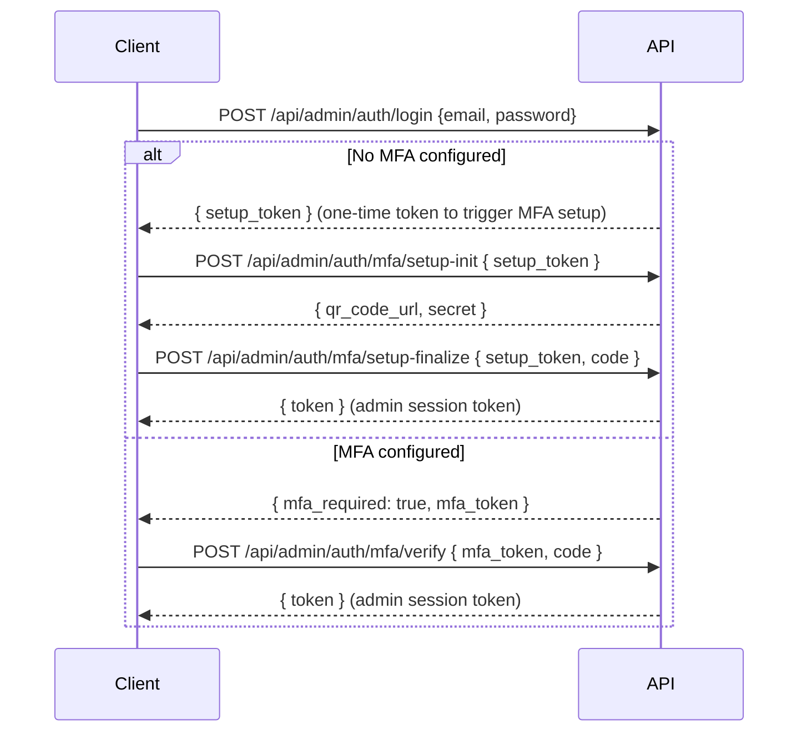

# 3. Backend API

Base URL: `https://satview.eu/api`  
All responses use a consistent envelope (see §3.2).

---

## 3.1 Authentication Model

Three actor types are accepted depending on the endpoint group:

| Actor | Mechanism | Header / Cookie |
|-------|-----------|----------------|
| Guest | None | `X-Guest-ID: <uuid>` (optional, improves tracking) |
| Registered user | Sanctum bearer token | `Authorization: Bearer <token>` |
| API developer | API key | `X-API-Key: dm_live_<32chars>` or `?api_key=` |
| Admin | Sanctum bearer token (admin guard) | `Authorization: Bearer <token>` |

The `HandlePublicRequest` middleware resolves the actor in priority order: bearer token → API key → guest.

---

## 3.2 Response Envelope

Every API response uses this shape:

```json
{
  "success": true,
  "data": { ... },
  "meta": { ... }
}
```

**Errors:**
```json
{
  "success": false,
  "data": null,
  "error": {
    "code": "GUEST_LIMIT_REACHED",
    "message": "You've used your 10 free analyses today.",
    "details": {
      "limit": 10,
      "used": 10,
      "reset_at": "2026-05-10T23:59:59Z",
      "upgrade_url": "/register"
    }
  }
}
```

**Standard error codes:**

| Code | HTTP | Meaning |
|------|------|---------|
| `VALIDATION_ERROR` | 422 | Form validation failed; `details` contains field errors |
| `UNAUTHENTICATED` | 401 | Bearer token missing or invalid |
| `INVALID_API_KEY` | 401 | API key not found or deleted |
| `API_KEY_EXPIRED` | 401 | API key past `expires_at` |
| `RATE_LIMIT_EXCEEDED` | 429 | API key daily limit exhausted |
| `GUEST_LIMIT_REACHED` | 429 | Guest daily quota (10/day) exhausted |
| `SERVER_ERROR` | 500 | Unhandled exception (message hidden in production) |

---

## 3.3 Endpoint Reference

### Public — No Auth Required

#### `GET /api/health`
Docker health check and uptime monitor probe.

**Response:**
```json
{ "status": "ok", "env": "production", "time": "2026-05-10T18:00:00Z" }
```

---

#### `GET /api/catalog`
Full satellite TLE catalog for the globe view. Returns all satellites with a current TLE. Cached via `Cache-Control: public, max-age=3600`.

**Response:**
```json
{
  "success": true,
  "data": {
    "satellites": [
      {
        "norad_id": "25544",
        "name": "ISS (ZARYA)",
        "type": "satellite",
        "line1": "1 25544U ...",
        "line2": "2 25544 ..."
      }
    ],
    "total": 32847,
    "generated_at": "2026-05-10T12:00:00Z"
  }
}
```

---

#### `GET /api/satellites/search?q={query}`
Full-text satellite name search. Returns up to 20 matches. Public, no quota.

**Query params:**
| Param | Type | Notes |
|-------|------|-------|
| `q` | string | Min 2 chars; matches name (FULLTEXT) or exact NORAD ID |

**Response:**
```json
{
  "data": [
    { "norad_id": "25544", "name": "ISS (ZARYA)", "object_type": "satellite" }
  ]
}
```

---

#### `GET /api/pages` · `GET /api/pages/{slug}`
CMS pages (published only). Used for About, Terms, Privacy, etc.

---

### Public — Quota-Gated (Guest / User / API Key)

These endpoints are wrapped by `HandlePublicRequest`. Guests are limited to **10 requests/day**; registered users have no web-request limit; API keys use their configured `daily_limit`.

**Rate-limit headers on all responses:**
```
X-Guest-Limit: 10
X-Guest-Requests-Remaining: 7
```
or for API keys:
```
X-RateLimit-Limit: 10000
X-RateLimit-Remaining: 9987
X-RateLimit-Reset: 1715385599
X-API-Tier: starter
```

---

#### `GET /api/satellites/{noradId}`
Full satellite record with current TLE.

**Path params:** `noradId` — numeric NORAD catalog number.

**Response:**
```json
{
  "success": true,
  "data": {
    "norad_id": "25544",
    "name": "ISS (ZARYA)",
    "object_type": "satellite",
    "international_designator": "1998-067A",
    "country_code": "ISS",
    "launch_date": "1998-11-20",
    "is_active": true,
    "tle_line1": "1 25544U ...",
    "tle_line2": "2 25544 ...",
    "tle_epoch": "2026-05-10T06:23:00Z",
    "tle_source": "spacetrack"
  }
}
```

---

#### `GET /api/satellites/{noradId}/orbit`
Propagated orbital ground track for the next 90 minutes (90 points × 1 min). Used by Tracker for orbit line rendering.

**Response:**
```json
{
  "success": true,
  "data": {
    "norad_id": "25544",
    "points": [
      { "lat": 51.6, "lon": -10.2, "alt": 408.3, "t": "2026-05-10T18:00:00Z" }
    ]
  }
}
```

---

#### `GET /api/conjunctions/{noradId}`
Conjunction events for a satellite (either as primary or secondary object). Returns active events (TCA within past 24 h to future 7 days), sorted by risk score descending.

**Response:**
```json
{
  "success": true,
  "data": {
    "satellite": "ISS (ZARYA)",
    "norad_id": "25544",
    "source": "cdm",
    "conjunctions": [
      {
        "id": 123,
        "other_norad_id": "45678",
        "other_name": "COSMOS 2251 DEB",
        "tca": "2026-05-11T14:32:00Z",
        "miss_distance_km": 0.42,
        "probability": 0.0001234,
        "risk_score": 75,
        "risk_level": "HIGH",
        "source": "cdm"
      }
    ],
    "overall_risk": "HIGH"
  }
}
```

---

### Customer Auth

#### `POST /api/auth/register`
Rate-limited: throttle group `registration`.

**Body:**
```json
{ "name": "Jane Smith", "email": "jane@example.com", "password": "...", "password_confirmation": "..." }
```

**Response:** `201` with `{ token, user }`.

---

#### `POST /api/auth/login`
Rate-limited: throttle group `auth`.

**Body:** `{ "email", "password" }`

**Response:** `{ token, user }` where `user` includes `subscription_plan`, `can_view_alerts`, `api_key_count`.

---

#### `POST /api/auth/forgot-password` · `POST /api/auth/reset-password`
Standard Laravel password reset flow. Sends email via configured SMTP.

---

#### `POST /api/auth/logout` _(auth required)_
Revokes the current Sanctum token.

---

#### `GET /api/auth/me` _(auth required)_
Returns current user profile including plan and entitlements.

---

#### `PATCH /api/auth/me` _(auth required)_
Update `name` or `email`.

---

#### `PATCH /api/auth/password` _(auth required)_
Change password. Requires `current_password`.

---

### Billing _(auth required)_

| Method | Path | Description |
|--------|------|-------------|
| GET | `/api/billing/plan` | Current plan, period dates, pricing catalog |
| GET | `/api/billing/history` | Payment history |
| POST | `/api/billing/subscribe` | Subscribe to a plan (mock mode) |
| POST | `/api/billing/cancel` | Cancel active subscription |

---

### API Keys _(auth required)_

| Method | Path | Description |
|--------|------|-------------|
| GET | `/api/keys` | List user's API keys with today's usage counts |
| POST | `/api/keys` | Create new key `{ name, tier }` |
| DELETE | `/api/keys/{id}` | Soft-delete a key |

---

### Watched Satellites _(auth required)_

| Method | Path | Description |
|--------|------|-------------|
| GET | `/api/watch` | List watched satellites |
| POST | `/api/watch` | Add `{ norad_id, name }` |
| DELETE | `/api/watch/{id}` | Remove from watch list |

---

### Alerts _(auth required, `can_view_alerts` plan gate)_

#### `GET /api/alerts`
Returns upcoming conjunction alerts for the user's watched satellites, sorted by TCA.

**Response:**
```json
{
  "success": true,
  "data": {
    "alerts": [
      {
        "id": 42,
        "primary_name": "ISS (ZARYA)",
        "secondary_name": "COSMOS 2251 DEB",
        "tca": "2026-05-11T14:32:00Z",
        "miss_distance_km": 0.42,
        "risk_score": 75,
        "risk_level": "HIGH",
        "source": "cdm",
        "hours_until_tca": 20.5
      }
    ]
  }
}
```

---

### Admin Auth

All admin endpoints are under `/api/admin`. Admin tokens are issued against the `admin_accounts` table and resolved by the `auth:admin` guard — completely separate from customer tokens.

#### MFA Login Flow



---

### Admin Panel _(admin auth required)_

| Method | Path | Description |
|--------|------|-------------|
| GET | `/api/admin/dashboard` | Counts: users, revenue, alerts, satellites |
| GET/POST | `/api/admin/users` | List / create users |
| GET/PATCH | `/api/admin/users/{id}` | View / update user |
| POST | `/api/admin/users/{id}/impersonate` | Get user's Sanctum token for support |
| GET | `/api/admin/subscriptions` | All subscriptions with pagination |
| GET | `/api/admin/payments` | Payment history |
| POST | `/api/admin/payments/{id}/refund` | Issue refund |
| GET | `/api/admin/api-keys` | All API keys across all users |
| GET | `/api/admin/audit-log` | Admin action log |
| CRUD | `/api/admin/pages` | CMS page management |
| POST | `/api/admin/pages/{id}/publish` | Publish draft |
| POST | `/api/admin/pages/{id}/unpublish` | Revert to draft |

---

## 3.4 Rate Limiting Groups

Defined in `AppServiceProvider` via `RateLimiter::for()`:

| Group | Limit | Applied to |
|-------|-------|-----------|
| `auth` | 10/min per IP | Login, forgot-password, reset-password |
| `registration` | 5/min per IP | Register |
| `admin-login` | 3/min per IP | Admin login |
| `admin-mfa` | 5/15min per IP | MFA verify |

---

## 3.5 Security Headers

`SecurityHeaders` middleware appends these to every response:

```
X-Content-Type-Options: nosniff
X-Frame-Options: DENY
X-XSS-Protection: 1; mode=block
Referrer-Policy: strict-origin-when-cross-origin
Strict-Transport-Security: max-age=31536000; includeSubDomains
Content-Security-Policy: default-src 'self'; ...
Permissions-Policy: camera=(), microphone=(), geolocation=()
```
