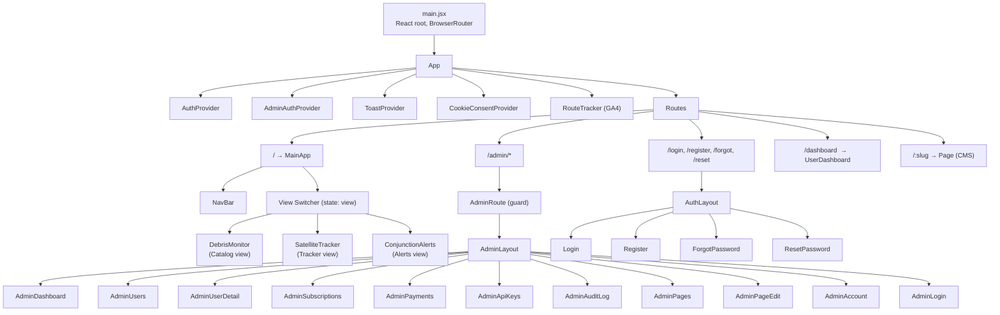
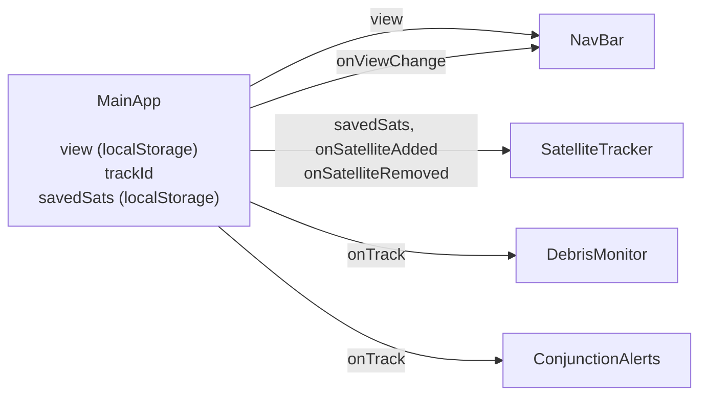
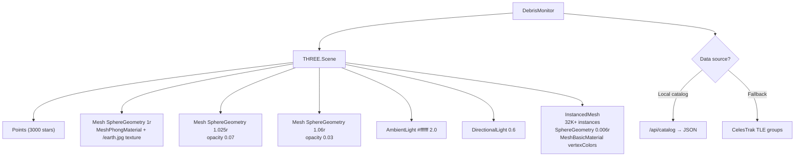
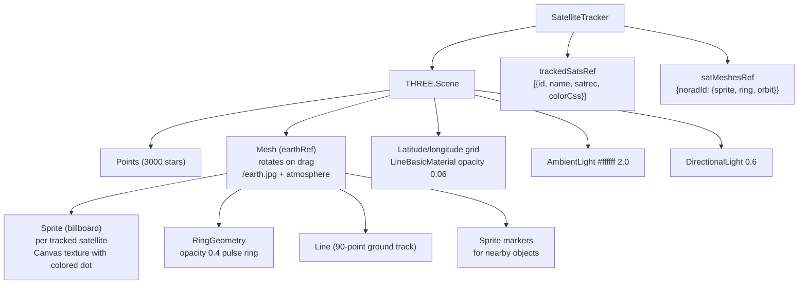
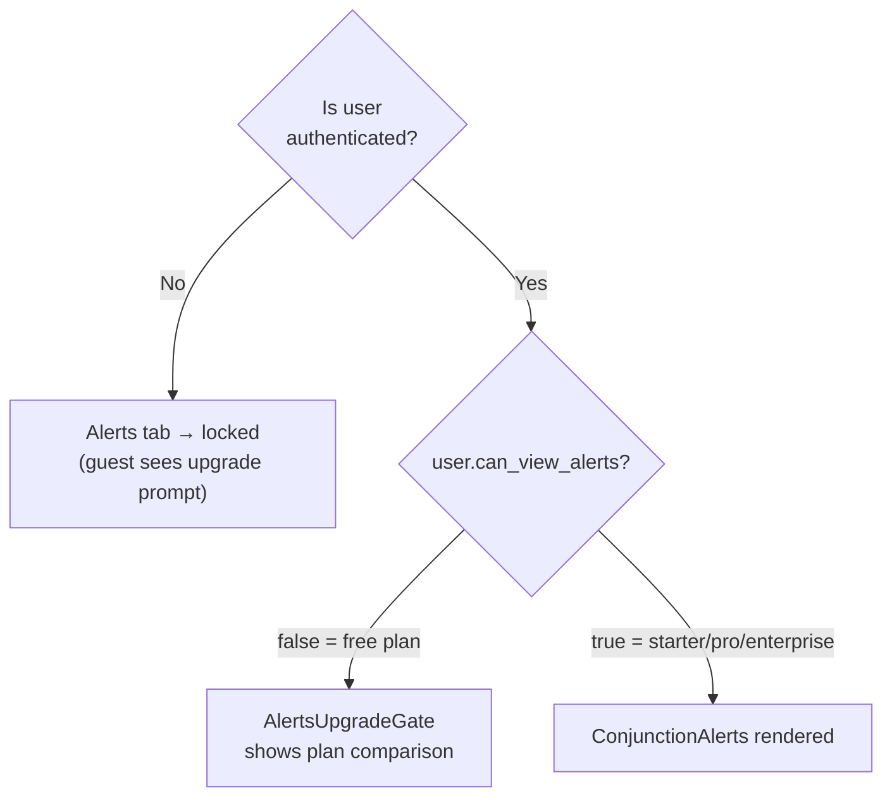

# 4. Frontend Architecture

## 4.1 Component Tree

---

## 4.2 Routing

React Router v6 with `BrowserRouter`. All routes are client-side — the nginx SPA config serves `index.html` for any non-asset path.

| Path | Component | Auth Required |
|------|-----------|---------------|
| `/` | `MainApp` (view switcher) | No |
| `/dashboard` | `UserDashboard` | Yes (`ProtectedRoute`) |
| `/login` | `Login` | No (redirects if authed) |
| `/register` | `Register` | No |
| `/forgot-password` | `ForgotPassword` | No |
| `/reset-password` | `ResetPassword` | No |
| `/:slug` | `Page` (CMS) | No |
| `/admin` | `AdminLogin` | No |
| `/admin/dashboard` | `AdminDashboard` | Admin token |
| `/admin/users` | `AdminUsers` | Admin token |
| `/admin/users/:id` | `AdminUserDetail` | Admin token |
| `/admin/subscriptions` | `AdminSubscriptions` | Admin token |
| `/admin/payments` | `AdminPayments` | Admin token |
| `/admin/api-keys` | `AdminApiKeys` | Admin token |
| `/admin/audit-log` | `AdminAuditLog` | Admin token |
| `/admin/pages` | `AdminPages` | Admin token |
| `/admin/pages/:id` | `AdminPageEdit` | Admin token |
| `/admin/account` | `AdminAccount` | Admin token |

---

## 4.3 Main Application State

`MainApp` (`App.jsx`) owns the view-level state and passes it down:

**localStorage keys** (all prefixed `satview_`):

| Key | Value | Description |
|-----|-------|-------------|
| `satview_view` | `"catalog"` \| `"tracker"` \| `"alerts"` | Last active tab — restored on reload |
| `satview_tracked` | `[{id, name}]` | NORAD IDs of tracked satellites |
| `satview_visible` | `{satellite, debris, rocket, unknown}` | Catalog type filter toggles |
| `dm_guest_id` | UUID | Guest session identifier for quota tracking |
| `dm_cookie_consent` | `{analytics, functional}` | Cookie consent flags |
| `satview_admin_token` | string | Admin Sanctum token |
| `satview_user_token` | string | Customer Sanctum token |

---

## 4.4 Globe — Catalog View (`DebrisMonitor.jsx`)

Three.js scene for the orbital object catalog.

**Key rendering properties:**
- `InstancedMesh` — single draw call for all objects, per-instance color and matrix
- Debris objects rendered at 0.5× scale
- Colors: satellites `#388bfd`, debris `#f85149`, rockets `#d29922`, unknown `#8b949e`
- Scene rotation on drag (not Earth mesh) — user rotates the whole scene
- TLE propagation: simplified Keplerian with 2-iteration Newton-Raphson eccentric anomaly solver (visualization only, not SGP4)
- Animation loop runs at `requestAnimationFrame`, reads `visibleRef` for per-frame filtering

---

## 4.5 Globe — Tracker View (`satellite-tracker.jsx`)

Three.js scene for tracking individual satellites with conjunction analysis.

**Key behaviors:**
- Earth mesh (`earthRef`) rotates on drag — sun stays fixed in scene space
- SGP4 propagation via `satellite.js` (`twoline2satrec` + `propagate`)
- Position updates every 1 second, orbit track recomputed on satellite add
- `savedSats` prop restored in parallel on mount (all TLE fetches concurrent)
- Conjunction analysis loaded per satellite via `/api/conjunctions/{noradId}`

---

## 4.6 API Clients

### `src/api/client.js` — Customer API
- Base URL: `/api` (relative — works in any environment)
- Attaches `Authorization: Bearer <token>` from localStorage
- Attaches `X-Guest-ID` header for unauthenticated requests
- Interceptor normalizes all errors to `{ type, code, message }` shape
- Sets `withCredentials: true` for Sanctum cookie compatibility

### `src/api/adminClient.js` — Admin API
- Base URL: `/api/admin`
- Attaches `Authorization: Bearer <admin_token>`
- Separate interceptor for admin-specific error handling
- Redirects to `/admin` login on 401

---

## 4.7 Auth Contexts

### `AuthContext`
Wraps the customer auth flow. On mount, calls `/api/auth/me` to restore session. Exposes `{ user, loading, logout }`.

### `AdminAuthContext`
Wraps the admin auth flow. Stores admin token in `localStorage` under `satview_admin_token`. Exposes `{ admin, loading, adminLogout }`.

Both contexts are available throughout the app via `useAuth()` and `useAdminAuth()` hooks.

---

## 4.8 Entitlement-Gated UI

---

## 4.9 Key Third-Party Libraries

| Library | Version | Purpose |
|---------|---------|---------|
| `three` | ^0.167 | 3D globe rendering |
| `satellite.js` | ^5.0 | SGP4 orbital propagation |
| `react-router-dom` | ^6.x | Client-side routing |
| `axios` | ^1.x | HTTP client |
| `react-ga4` | ^2.x | Google Analytics 4 (consent-gated) |
| `dompurify` | ^3.x | HTML sanitization for CMS page content |
| `html2canvas` | ^1.x | PDF generation for MFA recovery codes |
