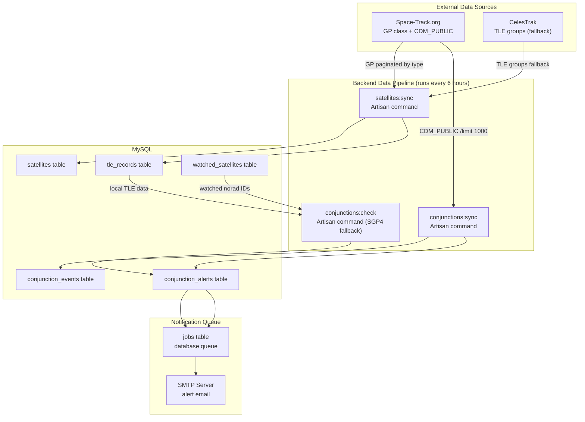
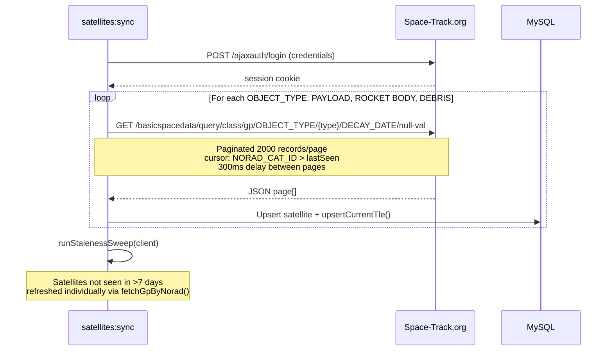
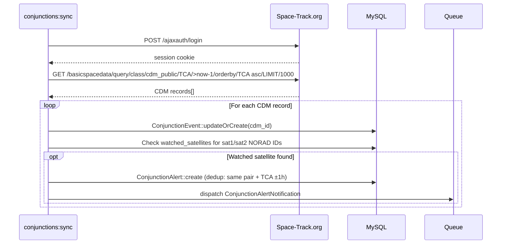
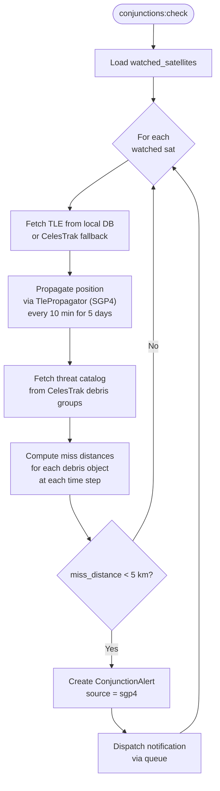
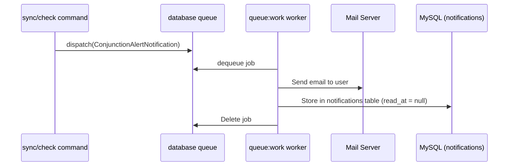

# 5. Data Pipeline

## 5.1 Overview



---

## 5.2 Satellite Catalog Sync (`satellites:sync`)

### Command signature
```
php artisan satellites:sync
    [--source=spacetrack]   # default; use --source=celestrak to force
    [--incremental]         # only fetch recently updated objects
    [--dry-run]             # parse without writing
    [--groups=]             # comma-separated CelesTrak groups (celestrak mode only)
```

### Space-Track flow (default)



**Upsert logic:**
1. `Satellite::updateOrCreate(['norad_id' => ...], [...])` — creates or updates catalog metadata
2. `$satellite->upsertCurrentTle($line1, $line2, 'spacetrack')` — flips previous `is_current` to false, inserts new record
3. Updates `last_seen_at` timestamp

**Staleness sweep:** Satellites where `last_seen_at < now() - 7 days` are queried individually from Space-Track to verify they're still tracked (or to update stale TLEs). This catches objects that were missed in the paginated full sync.

### CelesTrak flow (fallback)

When Space-Track credentials are not configured, or `--source=celestrak` is passed:

1. Fetches SATCAT CSV from `https://celestrak.org/pub/satcat.csv` to build a type-classification map (NORAD ID → object type)
2. Fetches TLE groups: `active`, `fengyun-1c-debris`, `cosmos-2251-debris`, `iridium-33-debris`, `2019-006`
3. Each group provides TLE text (3-line format: name, line1, line2)
4. Object type determined by SATCAT lookup: `PAY`→satellite, `R/B`→rocket_body, `DEB`→debris

### Schedule
```
satellites:sync   every 6 hours   withoutOverlapping   runInBackground
```

---

## 5.3 Conjunction Sync (`conjunctions:sync`)

Fetches real CDM (Conjunction Data Message) records from Space-Track.

### Flow



**CDM fields mapped:**

| CDM field | DB column |
|-----------|-----------|
| `CDM_ID` | `cdm_id` |
| `CREATION_DATE` | `created_at_cdm` |
| `TCA` | `tca` |
| `MIN_RNG` | `min_range_km` |
| `PC` | `probability` |
| `EMERGENCY_REPORTABLE` | `emergency_reportable` |
| `SAT1_OBJECT_DESIGNATOR` | `sat1_norad_id` |
| `SAT1_OBJECT_NAME` | `sat1_name` |
| `SAT2_OBJECT_DESIGNATOR` | `sat2_norad_id` |
| `SAT2_OBJECT_NAME` | `sat2_name` |

### Alert deduplication
Before creating a `ConjunctionAlert`, the command checks whether an alert already exists for the same `primary_norad_id + secondary_norad_id` pair with a TCA within ±1 hour of the current event. This prevents duplicate notifications when the same close approach is updated in successive CDM syncs.

### Schedule
```
conjunctions:sync   every 6 hours   withoutOverlapping   runInBackground
```

---

## 5.4 SGP4 Conjunction Screening (`conjunctions:check`)

Fallback screening using local TLE data when Space-Track credentials are unavailable, or to supplement CDM data.

### Flow



**TlePropagator service:** Wraps `satellite.js`-compatible PHP SGP4 propagation logic. Computes ECI position vectors and converts to geodetic for distance calculation.

### Key parameters
- Screening horizon: **5 days** forward
- Time resolution: **10-minute intervals**
- Alert threshold: miss distance < **5 km**
- Threat catalog: `fengyun-1c-debris`, `cosmos-2251-debris`, `iridium-33-debris`, `2019-006`, `rocket-bodies`

---

## 5.5 Risk Scoring

Risk score is computed on `ConjunctionEvent` and `ConjunctionAlert` without stored computation — it's derived from stored fields:

```php
// From ConjunctionEvent::riskScore()
$fromDist = max(0, round(100 * max(0, 1 - $this->min_range_km / 10.0)));

if ($this->probability !== null && $this->probability > 0) {
    $fromPc = match(true) {
        $this->probability >= 0.001    => 90,
        $this->probability >= 0.0001   => 75,
        $this->probability >= 0.00001  => 55,
        $this->probability >= 0.000001 => 35,
        default                        => 15,
    };
    return max($fromDist, $fromPc);
}
return $fromDist;
```

| Risk Level | Score Range |
|-----------|-------------|
| HIGH | 70–100 |
| MEDIUM | 40–69 |
| LOW | 0–39 |

---

## 5.6 Notifications (`ConjunctionAlertNotification`)

Dispatched as a queued job from both `conjunctions:sync` and `conjunctions:check`.



The notification marks `conjunction_alerts.notified_at = now()` after dispatch to prevent re-notification on subsequent sync runs.

---

## 5.7 Database Backup (`db:backup`)

```
php artisan db:backup
```

Runs daily at 02:00 UTC via scheduler. Stores compressed `.sql.gz` files in `storage/app/backups/`. Retains the 7 most recent backups.

The VPS-level `deploy/backup-db.sh` script runs independently via cron and uploads to Cloudflare R2 (30-day retention). The two backup systems are complementary — local gives fast restore, R2 gives offsite protection.

---

## 5.8 Full Schedule Summary

| Command | Frequency | Overlap guard | Output log |
|---------|-----------|---------------|------------|
| `satellites:sync` | Every 6 h | Yes | `storage/logs/satellites.log` |
| `conjunctions:sync` | Every 6 h | Yes | `storage/logs/conjunctions.log` |
| `conjunctions:check` | Every 6 h | Yes | `storage/logs/conjunctions-sgp4.log` |
| `db:backup` | Daily 02:00 | Yes | `storage/logs/db-backup.log` |
