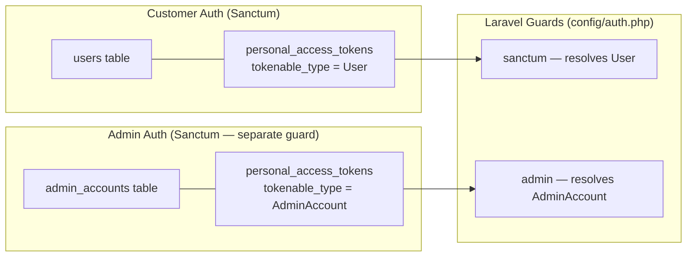
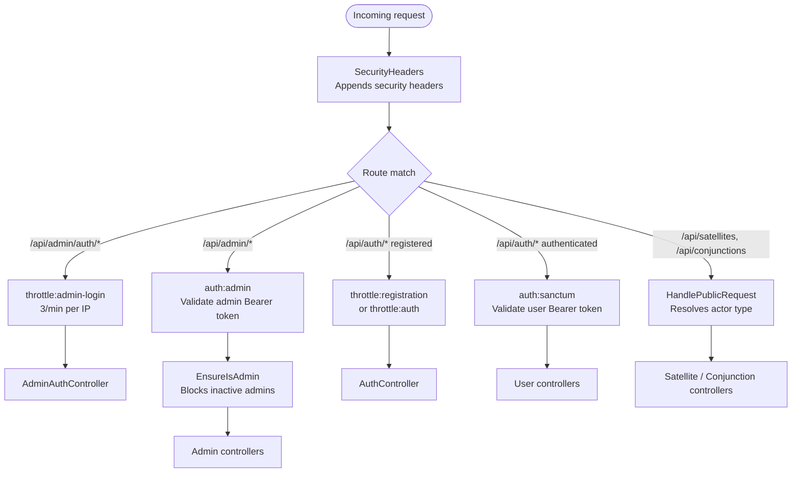
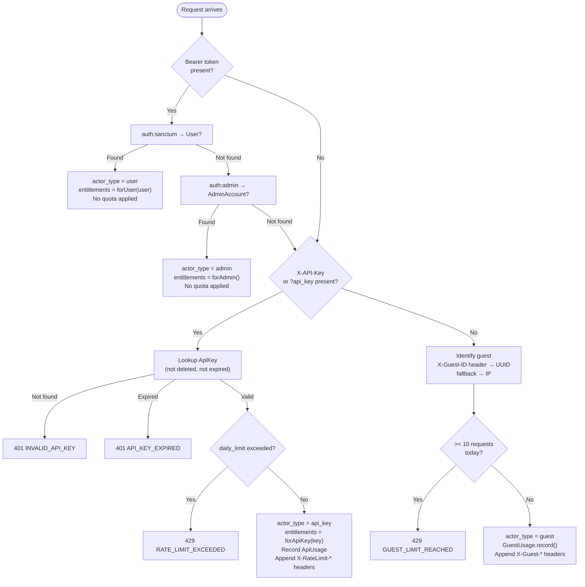
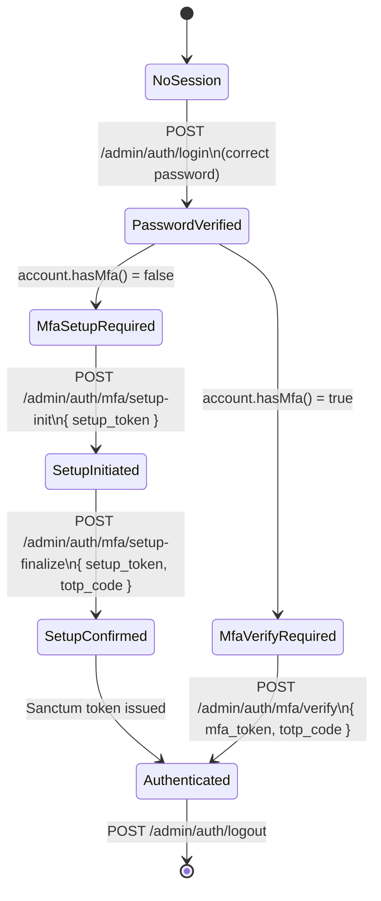

# 6. Access Control & Entitlements

## 6.1 Auth Architecture

SatView has two completely independent authentication systems that share no state:



The `auth:admin` guard is defined in `config/auth.php` with `provider: admin_accounts`. A customer token can never authenticate as an admin, and an admin token can never authenticate as a customer — the guards query different tables.

---

## 6.2 Middleware Stack



---

## 6.3 `HandlePublicRequest` — Actor Resolution

This middleware is the core of the public API access model. It resolves one of three actor types and attaches entitlements to the request for downstream controllers to use.



---

## 6.4 Plan Tiers & Entitlements

`EntitlementService` is the single source of truth for all plan capabilities. No capability checks are hardcoded in controllers.

### Capability Matrix

| Capability | Guest | Free | Starter | Pro | Enterprise |
|-----------|-------|------|---------|-----|-----------|
| `requests_per_day` | 10 | 500 | 10,000 | 100,000 | Unlimited |
| `can_view_nearby_objects` | ✓ | ✓ | ✓ | ✓ | ✓ |
| `can_view_alerts` | — | — | ✓ | ✓ | ✓ |
| `can_manage_watched_satellites` | — | ✓ | ✓ | ✓ | ✓ |
| `can_receive_alerts` | — | — | ✓ | ✓ | ✓ |
| `can_use_api_keys` | — | ✓ | ✓ | ✓ | ✓ |
| `webhooks_enabled` | — | — | ✓ | ✓ | ✓ |
| `satellite_limit` | — | 5 | Unlimited | Unlimited | Unlimited |

### Pricing (current)

| Plan | Price |
|------|-------|
| Starter | $29/mo |
| Pro | $99/mo |
| Enterprise | $499/mo |

### Add-ons
The `users.addons` JSON column allows per-user capability overrides. Example: a lifetime deal user on the `free` plan could have `{"can_view_alerts": true, "can_receive_alerts": true}`. `EntitlementService::forUser()` merges these on top of the base plan.

---

## 6.5 Admin Auth — MFA Flow

Admin accounts require TOTP (Time-based One-Time Password) MFA. On first login, the admin is forced through a setup flow before a session token is issued.



**Security properties:**
- `setup_token` is a short-lived (15 min) token issued only during the setup flow — it cannot be used to get a session
- `mfa_token` is issued for the verify step only — it has no API access
- Both tokens are single-use
- MFA secret stored encrypted (AES-256-GCM via Laravel's `encrypted` cast)
- Recovery codes: 8 one-time codes, stored encrypted, downloadable as PDF via `downloadRecoveryPdf.js`

---

## 6.6 Admin Audit Log

Every state-changing action by an admin is recorded in `admin_audit_logs`. The `AdminAccountObserver` hooks into Eloquent model events to automatically log `created`, `updated`, `deleted` actions on `AdminAccount` itself. Controllers call `AdminAuditLog::create()` explicitly for user management actions.

**Logged actions include:** `login`, `logout`, `user.suspend`, `user.unsuspend`, `user.impersonate`, `user.create`, `subscription.cancel`, `payment.refund`, `page.publish`, `page.delete`, `mfa.disable`

Each log entry captures:
- `admin_account_id` (nullable — null for system-generated entries)
- `action` string
- `subject` JSON (resource type + ID)
- `metadata` JSON (IP, user-agent, before/after values)

---

## 6.7 Guest Identification

Guests are identified by a UUID stored in `localStorage` under `dm_guest_id` and sent as `X-Guest-ID` on every API request. This is generated once at app load in `App.jsx`:

```js
if (!localStorage.getItem('dm_guest_id')) {
  localStorage.setItem('dm_guest_id', crypto.randomUUID());
}
```

If no header is present (e.g., direct API calls), the middleware falls back to the request IP address. The UUID approach is preferred because multiple users on the same NAT IP share a quota under IP-based identification.

The daily quota resets at midnight UTC (GuestUsage rows are per-date).
