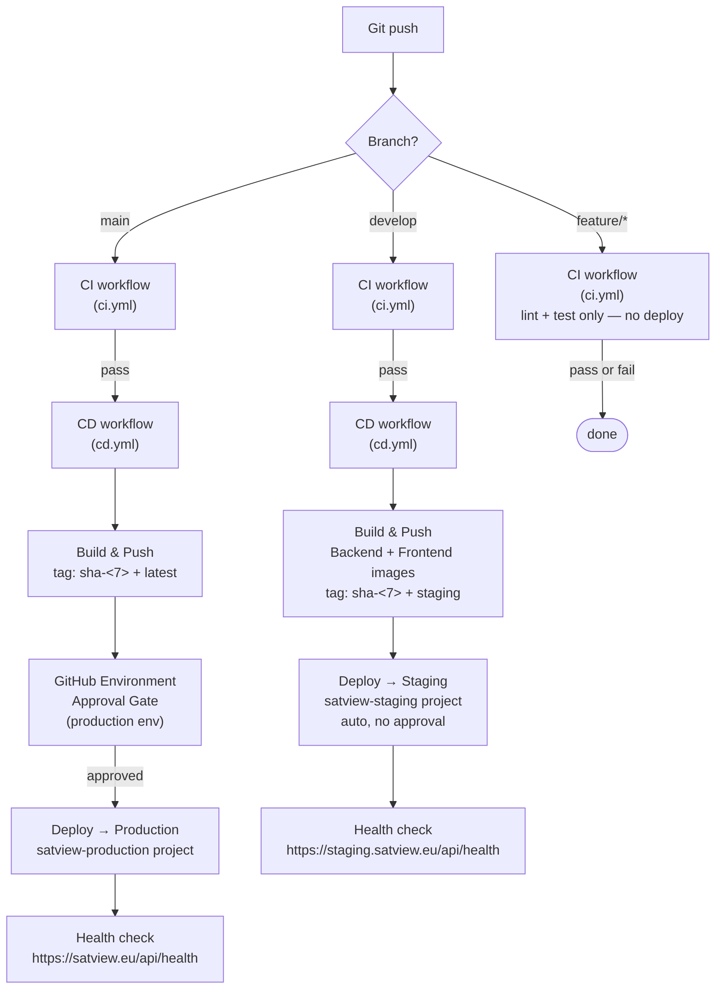
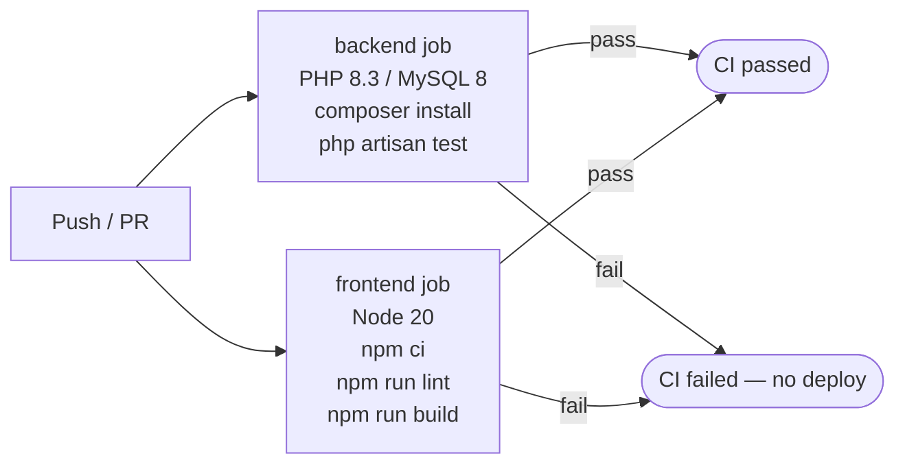

# 7. CI/CD & Deployment

## 7.1 Pipeline Overview



---

## 7.2 CI Workflow (`ci.yml`)

Triggers on push to any branch and on pull requests.



**Backend test environment:**
- MySQL 8 service container with `debris_test` database
- `APP_KEY` generated at runtime in `tests/bootstrap.php` (no hardcoded key)
- `.env.testing` used for test configuration
- 18 feature test files covering auth, admin, alerts, billing, satellite catalog, guest access, security headers

**Frontend test environment:**
- Node 20
- Vitest + React Testing Library
- ESLint enforced (lint failure = CI failure)

---

## 7.3 CD Workflow (`cd.yml`)

Triggers only after CI passes (`workflow_run` event). Never runs on a failed CI.

### Image Tagging Strategy

Every deployment produces two tags:

| Tag | Format | Purpose |
|-----|--------|---------|
| Immutable | `sha-<7chars>` e.g. `sha-e61b5cc` | Used in compose files for deployment and rollback |
| Mutable | `latest` (main) or `staging` (develop) | Convenience — always points to newest |

Images are stored in GHCR:
```
ghcr.io/ponastadas/debris-monitor-backend:sha-e61b5cc
ghcr.io/ponastadas/debris-monitor-frontend:sha-e61b5cc
```

### Deploy Script (per environment)

Each environment runs this sequence over SSH:

```bash
1. docker login ghcr.io              # Auth with GITHUB_TOKEN
2. docker compose pull               # Pull sha-tagged images
3. mysqldump > ~/backups/pre-deploy-*.sql   # DB snapshot before migration
4. docker compose up -d --remove-orphans   # Rolling restart
5. php artisan migrate --force       # Run pending migrations
6. curl https://satview.eu/api/health  # 60s health check (12 × 5s)
7. docker image prune --filter until=72h   # Keep last 3 days of images for rollback
```

### Rollback Procedure

```bash
# Find the SHA to rollback to
git log --oneline

SHORT_SHA=abc1234
BACKEND_IMAGE=ghcr.io/ponastadas/debris-monitor-backend:sha-${SHORT_SHA}
FRONTEND_IMAGE=ghcr.io/ponastadas/debris-monitor-frontend:sha-${SHORT_SHA}

# On the server
BACKEND_IMAGE="${BACKEND_IMAGE}" FRONTEND_IMAGE="${FRONTEND_IMAGE}" \
  docker compose -f ~/satview-production/docker-compose.yml \
  --project-name satview-production up -d
```

Images are pruned only after 72 hours, so the last ~3 deployments are always available for instant rollback.

---

## 7.4 Environment Configuration

### GitHub Secrets Required

| Secret | Used in | Description |
|--------|---------|-------------|
| `STAGING_HOST` | CD staging job | Staging server IP/hostname |
| `STAGING_USER` | CD staging job | SSH username |
| `STAGING_SSH_KEY` | CD staging job | Ed25519 private key |
| `PROD_HOST` | CD production job | Production server IP/hostname |
| `PROD_USER` | CD production job | SSH username |
| `PROD_SSH_KEY` | CD production job | Ed25519 private key |
| `GITHUB_TOKEN` | All jobs | Built-in, used for GHCR push/pull |

### GitHub Environments

| Environment | Protection | Branch |
|-------------|-----------|--------|
| `staging` | None (auto-deploy) | `develop` |
| `production` | Required reviewers | `main` |

The `production` environment requires manual approval in the GitHub UI before the deploy job runs. This prevents accidental deploys to production.

---

## 7.5 Server `.env` File

The server `.env` file is **never committed**. It must be created manually on first setup. Key variables:

```env
# App
APP_KEY=base64:<generate with php artisan key:generate --show>
APP_ENV=production
APP_DEBUG=false
APP_URL=https://satview.eu

# Database (must match docker-compose.yml MYSQL_* vars)
DB_CONNECTION=mysql
DB_HOST=db
DB_DATABASE=satview
DB_USERNAME=satview
DB_PASSWORD=<strong-password>
DB_ROOT_PASSWORD=<strong-root-password>

# Queue & Cache
QUEUE_CONNECTION=database
CACHE_STORE=database
SESSION_DRIVER=database

# External data
SPACE_TRACK_USER=<space-track-email>
SPACE_TRACK_PASS=<space-track-password>

# Mail
MAIL_MAILER=smtp
MAIL_HOST=<smtp-host>
MAIL_PORT=587
MAIL_USERNAME=<smtp-user>
MAIL_PASSWORD=<smtp-password>
MAIL_FROM_ADDRESS=noreply@satview.eu

# Sanctum
SANCTUM_STATEFUL_DOMAINS=satview.eu
FRONTEND_URL=https://satview.eu

# Traefik TLS
ACME_EMAIL=admin@satview.eu
```

---

## 7.6 Branch Strategy

```
main         ←── production
  ↑
develop      ←── staging (auto-deploy)
  ↑
feature/*    ←── development (CI only)
fix/*        ←── development (CI only)
```

- Feature branches merge to `develop` via PR
- `develop` auto-deploys to `staging.satview.eu` on every push
- `develop` → `main` PR triggers production deploy with approval gate
- Hotfixes branch from `main` and merge back to both `main` and `develop`

---

## 7.7 Docker Build Caching

GitHub Actions cache is scoped per service to avoid cache poisoning between backend and frontend:

```yaml
cache-from: type=gha,scope=${{ matrix.service }}
cache-to:   type=gha,scope=${{ matrix.service }},mode=max
```

`mode=max` caches all intermediate layers, not just the final image. This makes subsequent builds significantly faster when only application code changes (dependencies layer is cache-hit).
