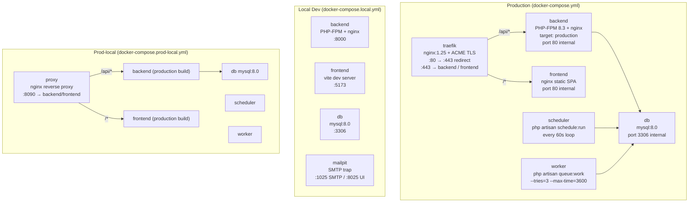

# 8. Infrastructure

## 8.1 Docker Service Map



---

## 8.2 Production Stack (`docker-compose.yml`)

### Service Details

| Service | Image | Key config |
|---------|-------|-----------|
| `traefik` | `traefik:v3` | Port 80/443; Let's Encrypt ACME; routes by Host header |
| `backend` | `ghcr.io/ponastadas/debris-monitor-backend:sha-*` | PHP-FPM + nginx in one container via supervisord |
| `frontend` | `ghcr.io/ponastadas/debris-monitor-frontend:sha-*` | nginx serving pre-built `dist/` |
| `db` | `mysql:8.0` | `--default-authentication-plugin=mysql_native_password` |
| `scheduler` | Same backend image | `while true; do php artisan schedule:run; sleep 60; done` |
| `worker` | Same backend image | `php artisan queue:work --sleep=3 --tries=3 --max-time=3600` |

### Networks
```
web (external)    ← Traefik uses this to discover containers by label
prod_net (internal) ← All services communicate on this
```

### Volumes
```
db_data      ← MySQL data directory (persistent across restarts)
storage_app  ← Laravel storage/app (backups, uploads)
traefik_certs ← TLS certificates from Let's Encrypt
```

---

## 8.3 Backend Container (`backend/Dockerfile`)

Multi-stage build:

```
Stage 1: composer (php:8.3-cli-alpine)
  └── COPY composer.json/lock
  └── composer install --no-dev --optimize-autoloader

Stage 2: node-builder (node:20-alpine)
  └── npm ci && npm run build
  └── Produces /app/public/build (Vite assets)

Stage 3: production (php:8.3-fpm-alpine)
  └── Install php extensions (pdo_mysql, mbstring, etc.)
  └── COPY --from=composer /app/vendor
  └── COPY --from=node-builder /app/public/build
  └── COPY backend/docker/nginx.conf
  └── COPY backend/docker/supervisord.conf
  └── supervisord manages: php-fpm + nginx
  └── EXPOSE 80
```

The backend container runs **both PHP-FPM and nginx** via supervisord. nginx handles HTTP and proxies `.php` requests to FPM on `127.0.0.1:9000`.

---

## 8.4 Frontend Container (`frontend/Dockerfile`)

```
Stage 1: builder (node:20-alpine)
  └── npm ci
  └── npm run build → dist/

Stage 2: production (nginx:1.25-alpine)
  └── COPY dist/ → /usr/share/nginx/html/
  └── COPY docker/nginx.conf → /etc/nginx/conf.d/default.conf
  └── EXPOSE 80
```

**Frontend nginx config** (`frontend/docker/nginx.conf`):
```nginx
# SPA fallback — serve index.html for all non-asset routes
location / {
    try_files $uri $uri/ /index.html;
}
# Cache static assets aggressively
location ~* \.(js|css|png|jpg|svg|woff2)$ {
    expires 1y;
    add_header Cache-Control "public, immutable";
}
```

---

## 8.5 Reverse Proxy Routing

### Production (Traefik)

Traefik discovers services by Docker labels. Routing rules:

| Rule | Target service | Notes |
|------|---------------|-------|
| `Host(satview.eu) && PathPrefix(/api)` | `backend:80` | API calls |
| `Host(satview.eu)` | `frontend:80` | SPA |
| `Host(staging.satview.eu) && PathPrefix(/api)` | staging backend | |
| `Host(staging.satview.eu)` | staging frontend | |

TLS is handled by Traefik's ACME resolver using Let's Encrypt. Certificates are stored in the `traefik_certs` volume.

### Prod-Local (nginx)

```nginx
# docker/nginx-proxy.conf
server {
    listen 80;

    location /api {
        proxy_pass http://backend:80;
        proxy_read_timeout 120s;
    }

    location / {
        proxy_pass http://frontend:80;
    }
}
```

Accessible at `http://localhost:8090`.

---

## 8.6 Local Development Stack (`docker-compose.local.yml`)

Key differences from production:

| Aspect | Production | Local |
|--------|-----------|-------|
| Frontend | nginx static | Vite dev server (HMR) |
| Backend build | Multi-stage optimized | Dev build with volume mounts |
| Code | Baked into image | Mounted from host filesystem |
| Mail | SMTP server | Mailpit (catches all emails) |
| Proxy | Traefik | Not used — ports exposed directly |
| Ports | 80/443 | Backend :8000, Frontend :5173 |

**Mailpit** at `http://localhost:8025` catches all outbound email in development. No real email is sent.

---

## 8.7 Makefile Commands Reference

### Development

| Command | Description |
|---------|-------------|
| `make up` | Start local stack (build + foreground) |
| `make up-d` | Start local stack (background) |
| `make down` | Stop containers |
| `make reset` | Stop + wipe DB volumes |
| `make setup` | First-time: start DB, generate APP_KEY, migrate, seed, sync catalog |
| `make test` | Run backend Pest tests |
| `make test-filter filter=...` | Run filtered tests |
| `make lint` | Run Pint (PHP) + ESLint (JS) |
| `make shell` | bash into backend container |
| `make shell-db` | mysql CLI into db container |
| `make logs` | Follow all container logs |
| `make logs-backend` | Follow backend logs only |

### Data sync

| Command | Description |
|---------|-------------|
| `make sync-catalog` | Sync satellite catalog (Space-Track default) |
| `make sync-catalog-celestrak` | Force CelesTrak as source |
| `make sync-conjunctions` | Sync CDM conjunction data |
| `make sync-all` | Both catalog + conjunctions |
| `make seed-conjunctions` | Seed demo conjunction data (no credentials needed) |

### Database

| Command | Description |
|---------|-------------|
| `make backup` | Create DB backup via `php artisan db:backup` |
| `make restore file=...` | Restore from a backup file |

### Production-local

| Command | Description |
|---------|-------------|
| `make prod-local-setup` | First-time prod-local: DB up, migrate, seed, sync |
| `make prod-local` | Build and start full prod-local stack |
| `make prod-local-down` | Stop prod-local stack |
| `make prod-local-reset` | Wipe prod-local DB volumes |
| `make prod-local-logs` | Follow prod-local logs |
| `make prod-local-shell` | bash into prod-local backend |

---

## 8.8 VPS Backup Strategy

Two independent backup layers:

```
VPS (Hetzner CX22, €4.5/mo)
├── storage/app/backups/         ← PHP artisan db:backup (daily, 7-day retention)
│                                   Fast local restore; lost if server is destroyed
└── /var/backups/satview/        ← deploy/backup-db.sh (daily cron, 30-day retention)
    └── → Cloudflare R2          ← Offsite; survives server destruction
        bucket: satview-backups
```

**Restore procedure:**
```bash
# List available backups
/opt/satview/deploy/restore-db.sh

# Restore specific backup (downloads from R2 if not local)
/opt/satview/deploy/restore-db.sh db_20260510_020001.sql.gz
```

---

## 8.9 Environment Summary

| Environment | URL | Compose file | Trigger |
|-------------|-----|-------------|---------|
| Local dev | localhost:5173 (frontend) / :8000 (API) | `docker-compose.local.yml` | Manual `make up` |
| Prod-local | localhost:8090 | `docker-compose.prod-local.yml` | Manual `make prod-local` |
| Staging | staging.satview.eu | `docker-compose.staging.yml` | Push to `develop` |
| Production | satview.eu | `docker-compose.yml` | Push to `main` + approval |
